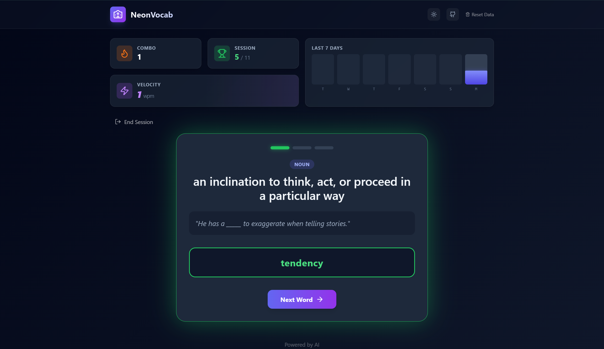

# NeonVocab

A modern, AI-powered vocabulary learning application built with React 19, TypeScript, and Google Gemini. Master new words with an elegant, distraction-free interface featuring dynamic theming and smart progress tracking.

Experience now on https://mirpri.github.io/neonvocab



Built with the help of


## ✨ Features

- **🧠 AI-Powered Definitions**: Automatically fetches definitions, parts of speech, and example sentences using Google's Gemini API.
- **📚 Smart Learning System**: 
  - Spaced repetition-inspired mastery tracking.
  - Words are marked as "Mastered" after 3 successful attempts.
  - "Stuck" prevention logic ensures you learn effectively.
- **🎨 Dynamic Theming**: 
  - Beautiful Light and Dark modes.
  - Animated, soothing gradient backgrounds (Paper White for Light, Deep Midnight for Dark).
  - Smooth transitions and glassmorphism effects.
- **⚡ Interactive Gameplay**:
  - Spelling challenges with immediate feedback.
  - Progressive Hint System (Length → Reveal Letters).
  - Shake animations for errors, confetti/pop effects for success.
- **📊 Stats & Progress**:
  - Track your daily streak.
  - Monitor learning velocity (words/minute).
  - Visualize total words mastered and days active.
- **💾 Local Persistence**: All your words, progress, and settings are saved automatically to your browser.

## 🛠️ Tech Stack

- **Framework**: [React 19](https://react.dev/)
- **Build Tool**: [Vite](https://vitejs.dev/)
- **Language**: [TypeScript](https://www.typescriptlang.org/)
- **Styling**: [Tailwind CSS](https://tailwindcss.com/)
- **AI Integration**: [Google GenAI SDK](https://www.npmjs.com/package/@google/genai)
- **State Management**: [Zustand](https://github.com/pmndrs/zustand) (see `store/vocabStore.ts`)
- **Icons**: [Lucide React](https://lucide.dev/)

## 🚀 Getting Started

### Prerequisites

- Node.js (v18 or higher)
- A Google Gemini API Key (Get one [here](https://aistudio.google.com/app/apikey))

### Installation

1. **Clone the repository**
   ```bash
   git clone https://github.com/yourusername/vocabmaster-ai.git
   cd vocabmaster-ai
   ```

2. **Install dependencies**
   ```bash
   npm install
   # or
   yarn install
   ```

3. **Configure Environment**
   Create a `.env` file in the root directory. You have two options for configuration:

   **Option A: Serverless / Static Site**
   Do not set `VITE_API_BASE_URL` and setup openai ***or*** gemini key and model.

   **Option B: Secure Backend (Recommended for Production)**
   *Use this if you are running the provided Node.js backend.*
   ```env
   # The frontend will ignore local keys and ask this URL instead
   VITE_API_BASE_URL=https://your-backend-url.com
   ```

4. **Run the development server**
   ```bash
   npm run dev
   # or
   yarn dev
   ```

5. **Open your browser**
   Navigate to `http://localhost:5173` to start learning!

## Backend Setup (Optional)

To protect your API keys, you can run the included Node.js backend.

1.  **Navigate to backend folder**: `cd backend`
2.  **Install dependencies**: `npm install`
3.  **Create .env**:
    ```env
    GEMINI_API_KEY=your_secret_key
    FRONTEND_URL=https://your-github-pages-url.github.io
    PORT=3000
    ```
4.  **Start Server**: `npm start`
5.  **Update Frontend**: Set `VITE_API_BASE_URL=http://localhost:3000` (or your production URL) in the frontend `.env`.

## Usage

1. **Add Words**: Click the "Import" section to paste a list of words you want to learn.
2. **Start Session**: Click "Start Learning" to begin.
3. **Learn**: 
   - Read the definition and example sentence.
   - Type the word.
   - Use hints if you get stuck (Eye icon for "I don't know", Bulb icon for hints).
4. **Mastery**: Correctly answer a word 3 times to master it.
5. **Theme**: Toggle between Light and Dark mode using the sun/moon icon in the header.

## 🤝 Contributing

Contributions are welcome! Please feel free to submit a Pull Request.

## 📄 License

This project is open source and available under the [MIT License](LICENSE).


